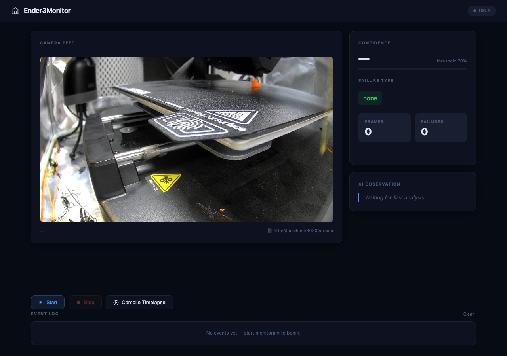
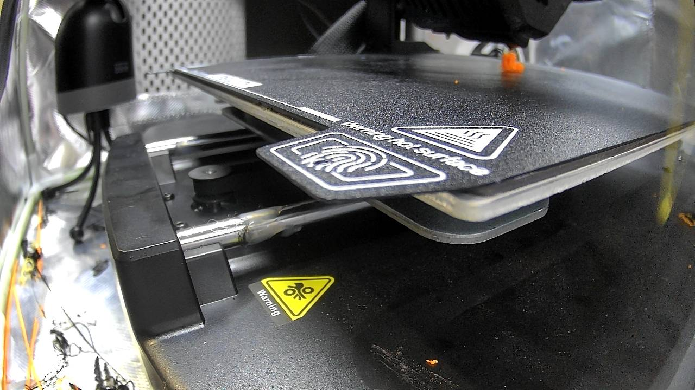

# Ender3Monitor

A 3D print failure detection system that watches your printer through a USB webcam, uses AI vision to spot problems in real time, fires email alerts when something goes wrong, and records a timelapse of every print.

Supports two AI backends: **Claude** (Anthropic API) and **llava:7b** (Ollama, free, runs locally on your machine).

---

## Features

- **Live failure detection** — analyzes a frame on a configurable interval (default 60s; the main cost dial)
- **Detects six failure types** — spaghetti/stringing, layer shifts, bed detachment, stopped extrusion, nozzle collisions, and warping
- **Frame pre-validation** — OpenCV checks brightness, contrast, and edge density before sending to AI; rejects dark, covered, or off-target frames without burning API calls
- **Print completion detection** — uses the printer's own status over USB when available (stops exactly when the print finishes); falls back to camera stillness (4 consecutive still frames) when no printer is connected
- **Printer control over USB** — live nozzle/bed temps, print progress and time remaining, auto-pause/cooldown on a confirmed failure, and manual pause/resume/cooldown/e-stop from the dashboard
- **Push notifications** — instant phone alerts via ntfy, Discord, or Telegram
- **Email alerts** — SMTP notification with failure type, confidence score, and attached snapshot
- **Web UI** — clean dark-theme dashboard at `http://localhost:8080`; start/stop monitoring, live camera feed, confidence gauge, AI observations, and event log
- **CLI** — terminal interface with live status line if you prefer to run headless
- **Prometheus metrics** — `/metrics` endpoint for frames analyzed, failure counts by type, and confidence score trends
- **Grafana dashboard** — pre-built JSON ready to import
- **Timelapse** — saves a frame every 30 seconds and compiles to a downloadable MP4 on demand
- **Multi-camera support** — auto-detects cameras, opens Preview snapshots so you can visually identify which index maps to your printer

---

## Screenshots



*Web dashboard — live camera feed, confidence gauge, AI observation, and event log*



*Live camera snapshot showing an active print in progress*

---

## Requirements

- Python 3.11+
- A USB webcam aimed at your printer
- One of:
  - [Anthropic API key](https://console.anthropic.com/) (Claude cloud backend)
  - [Ollama](https://ollama.com) running locally (free, no API key)
- An SMTP-capable email account for alerts (optional — Gmail works well)
- Prometheus + Grafana (optional — for the metrics dashboard)

---

## Installation

```bash
git clone https://github.com/btgendler2005/Ender3Monitor.git
cd Ender3Monitor
pip install -r requirements.txt
```

---

## Configuration

Copy the example and fill in your values:

```bash
cp .env.example .env
```

| Variable | Default | Description |
|---|---|---|
| `ANALYZER_BACKEND` | `anthropic` | `anthropic` or `ollama` |
| `ANTHROPIC_API_KEY` | — | Required when using the Anthropic backend |
| `ANTHROPIC_MODEL` | `claude-sonnet-4-6` | Claude model to use |
| `OLLAMA_MODEL` | `llava:7b` | Ollama vision model |
| `OLLAMA_HOST` | `http://localhost:11434` | Ollama server URL |
| `SMTP_HOST` | `smtp.gmail.com` | SMTP server |
| `SMTP_PORT` | `587` | SMTP port |
| `SMTP_USERNAME` | — | Email login |
| `SMTP_PASSWORD` | — | Email password or App Password |
| `SMTP_SENDER` | — | From address |
| `SMTP_RECIPIENT` | — | Where to send alerts |
| `CAMERA_INDEX` | `-1` | Camera to use; `-1` = prompt at startup |
| `CONFIDENCE_THRESHOLD` | `0.70` | Alert when confidence ≥ this value |
| `CAPTURE_INTERVAL_SECONDS` | `60` | Seconds between AI analyses — main cost dial (30≈$1/hr, 60≈$0.48/hr, 90≈$0.32/hr) |
| `METRICS_PORT` | `8000` | Prometheus metrics port |
| `TIMELAPSE_DIR` | `timelapse_frames` | Where to save timelapse frames |
| `TIMELAPSE_MAX_SESSIONS` | `20` | Keep at most this many recent print folders (older pruned) |
| `TIMELAPSE_RETENTION_DAYS` | `30` | Also delete timelapse folders/MP4s older than this |
| `TIMELAPSE_DELETE_FRAMES_AFTER_COMPILE` | `false` | Drop a session's JPEGs once compiled to MP4 |

---

## Choosing an AI backend

### Option A — Anthropic (Claude)

Best accuracy. Requires an API key and costs ~$0.40–1.00/hr depending on resolution.

```
ANALYZER_BACKEND=anthropic
ANTHROPIC_API_KEY=sk-ant-...
```

### Option B — Ollama (free, local)

Runs entirely on your machine — no API key, no ongoing cost.

**Install Ollama:**
```bash
# macOS
brew install ollama
brew services start ollama

# or download from https://ollama.com
```

**Pull the recommended model:**
```bash
ollama pull llava:7b    # ~4.1 GB download
```

**Set in `.env`:**
```
ANALYZER_BACKEND=ollama
OLLAMA_MODEL=llava:7b
```

**Model guide for 8 GB RAM (e.g. M2 MacBook Air):**

| Model | Size | Fits in 8 GB? | Quality |
|---|---|---|---|
| `llava:7b` | ~4.1 GB | ✅ Recommended | Good |
| `moondream` | ~1.4 GB | ✅ Easily | Limited |
| `llama3.2-vision:11b` | ~6.2 GB | ⚠️ Will swap | Better |

`llava:7b` is the best balance — fits alongside macOS overhead and uses the M2 GPU via Metal. Consider raising `CONFIDENCE_THRESHOLD` to `0.80` with Ollama, as local models can be overconfident.

---

## Email alerts (optional)

Alerts are sent via SMTP when a failure is detected above the confidence threshold, and again when a print is detected as complete.

### Gmail setup

Gmail requires an App Password when 2FA is enabled:

1. Go to **Google Account → Security → 2-Step Verification → App passwords**
2. Generate a password for "Mail"
3. Use that 16-character password as `SMTP_PASSWORD`
4. Set `SMTP_HOST=smtp.gmail.com` and `SMTP_PORT=587`

---

## Running the app

### Web UI (recommended)

```bash
python web.py
```

Open **http://localhost:8080** in your browser. The dashboard shows:
- Live camera snapshot (refreshes every 10 seconds)
- Confidence gauge with colour coding (green → amber → red)
- Current failure type and AI observation
- Frame and failure counters
- Start / Stop / Compile Timelapse buttons
- Event log of every analysed frame

### CLI

```bash
python monitor.py
```

| Command | Action |
|---|---|
| `start` | Open the camera and begin monitoring |
| `stop` | Stop monitoring |
| `timelapse` | Compile saved frames into an MP4 |
| `status` | Print current status and last result |
| `quit` | Stop and exit |

Live status line while monitoring:
```
  [14:23:01] Status: Monitoring…            | Frames:   12 | Failures:   0 | Confidence: 8.3% | Type: none
             Print progressing normally. First layer adhering well to bed.
```

### Camera selection

If `CAMERA_INDEX=-1` (the default), the app will detect all cameras, save a snapshot thumbnail from each to `/tmp/`, and open them in Preview (macOS) so you can see which index maps to which physical camera. Set `CAMERA_INDEX` in `.env` once confirmed to skip the prompt on future runs.

---

## Prometheus & Grafana (optional)

### 1. Install Prometheus

```bash
brew install prometheus
```

Edit `/opt/homebrew/etc/prometheus.yml` and add the scrape job:

```yaml
scrape_configs:
  - job_name: ender3monitor
    static_configs:
      - targets: ['localhost:8000']
```

Start Prometheus:
```bash
brew services start prometheus
# Dashboard at http://localhost:9090
```

### 2. Install Grafana

```bash
brew install grafana
brew services start grafana
# Dashboard at http://localhost:3000
# Default login: admin / admin
```

### 3. Connect Grafana to Prometheus

1. Open **http://localhost:3000**
2. Go to **Connections → Data Sources → Add data source**
3. Choose **Prometheus**
4. Set URL to `http://localhost:9090`
5. Click **Save & Test**

### 4. Import the dashboard

1. Go to **Dashboards → Import**
2. Upload `grafana/dashboard.json` from this repo
3. Select your Prometheus data source when prompted
4. Click **Import**

### Metrics exposed

| Metric | Type | Description |
|---|---|---|
| `printer_frames_analyzed_total` | Counter | Total frames sent for analysis |
| `printer_failures_detected_total{failure_type}` | Counter | Failures detected, labelled by type |
| `printer_last_confidence_score` | Gauge | Confidence score from the most recent frame |
| `printer_confidence_score_histogram` | Histogram | Distribution of confidence scores |
| `printer_monitoring_active` | Gauge | `1` while monitoring is running, `0` otherwise |

You can verify the metrics endpoint is working before setting up Prometheus:
```bash
curl http://localhost:8000/metrics
```

---

## Project structure

```
Ender3Monitor/
├── ender3monitor/          # Core package
│   ├── __init__.py
│   ├── analyzer.py         # AI analysis — pre-checks + Anthropic/Ollama backends
│   ├── camera.py           # Camera detection and snapshot capture
│   ├── config.py           # Configuration loaded from .env
│   ├── metrics.py          # Prometheus metrics
│   ├── notifier.py         # SMTP email alerts
│   └── timelapse.py        # Frame saving and MP4 compilation
├── grafana/
│   └── dashboard.json      # Pre-built Grafana dashboard (9 panels)
├── monitor.py              # CLI entry point — run with: python monitor.py
├── web.py                  # Web UI entry point — run with: python web.py
├── requirements.txt        # Python dependencies
├── .env.example            # Environment variable template
├── .gitignore              # Excludes .env, timelapse output, caches
├── LICENSE
└── README.md
```

---

## How it works

1. A background thread wakes up every `CAPTURE_INTERVAL_SECONDS` (default 60s)
2. A single frame is captured from the webcam, then the camera is immediately released (prevents OpenCV's background thread from running continuously)
3. Three fast OpenCV pre-checks run locally (brightness, contrast, edge density) — frames that are too dark, featureless, or not aimed at a printer are rejected without an API call
4. Valid frames are sent to Claude or llava:7b with a structured prompt; the model returns JSON with `failure_detected`, `failure_type`, `confidence`, and `description`
5. If confidence ≥ `CONFIDENCE_THRESHOLD` and a real failure is detected, an email alert is sent with the frame attached
6. Completion is detected from the printer's USB status when connected (monitoring stops the moment the print finishes); otherwise it falls back to camera stillness (4 consecutive still frames). Near the end, failure flagging is suppressed so the parked print head isn't mistaken for a gap/stopped-extrusion failure
7. Every 30 seconds a frame is saved for the timelapse
8. All results are pushed to Prometheus metrics in real time and broadcast to connected web UI clients via WebSocket

---

## License

MIT
